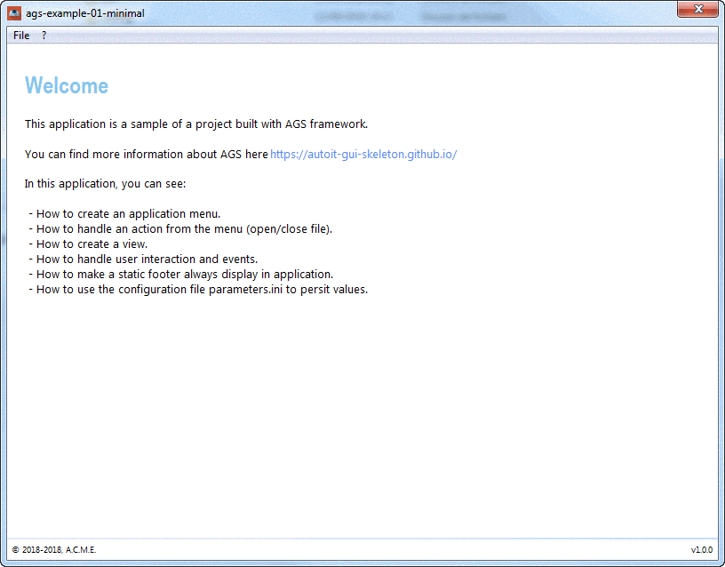
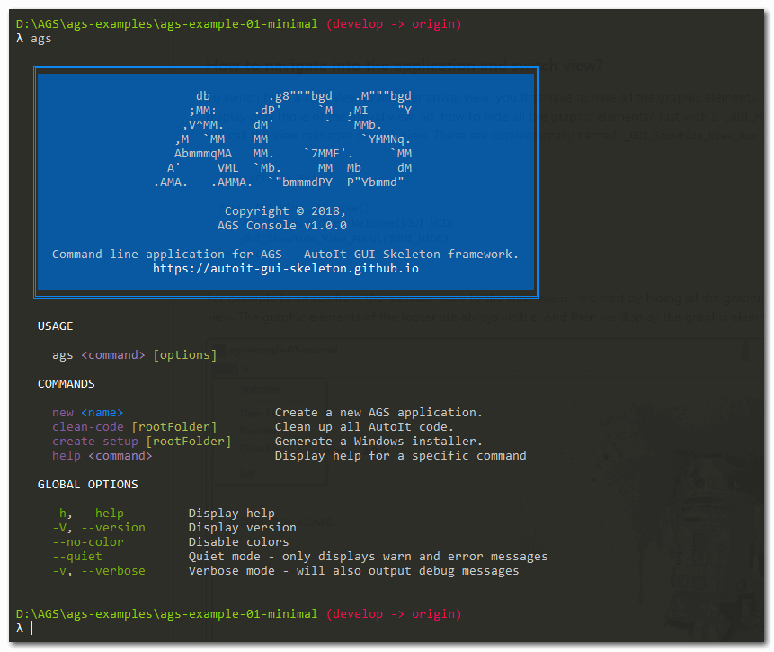
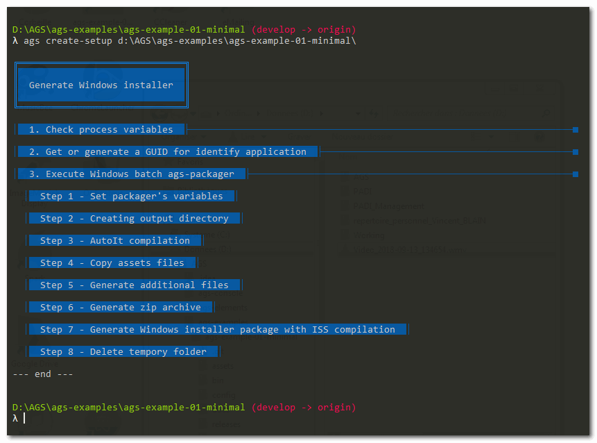
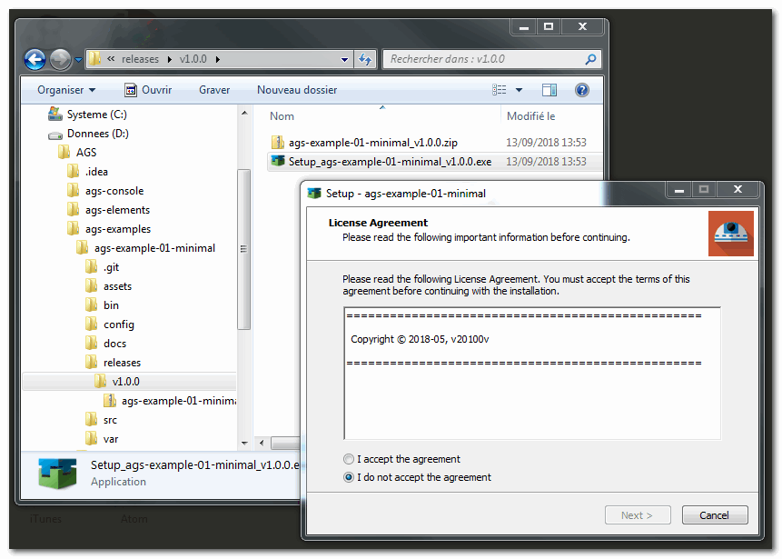

ags-example-01-minimal
======================


<br/>


## Goals

This project is an example of an application built with [AGS framework](https://autoit-gui-skeleton.github.io/), where you can see :

- How to create a view in AGS ;
- How to make a static footer, always display in application ;
- How to make a menu ;
- How to handle action execute from the menu (open/close file) ;
- How to handle event on graphic item of a view.


<br/>


## How the graphic user interface (GUI) is handled with AGS ?

This application have different graphics elements, that handled into this views : 'welcome', 'about' and 'footer' view.




### The main GUI manager

The `./src/GUI.au3` file is the entry point for all view managers, that are saved in the `./views` directory. We will call it main manager of the GUI. The code for each view is defined each time in a specific file and stored in this `./views` directory.

The main manager GUI contains especially the `app_start()` method, which allows to start the application. This method is only called from the main entry program of the application, and it was designed to create the user interface (GUI) and manage all user interactions and events in the application.

```autoit
;; ./src/GUI.au3 ;;

Func app_start()
	Global $main_GUI = GUICreate( _ 
	    $APP_NAME, $APP_WIDTH, $APP_HEIGHT, -1, -1, _ 
	    BitXOR($GUI_SS_DEFAULT_GUI, $WS_MINIMIZEBOX))

	_GUI_Init_Menu()

	; By default all elements of this view are visible
	_GUI_Init_Footer()

	; By default all elements of below views are hidden
	_GUI_Init_View_Welcome()
	_GUI_Init_View_About()

	; Set configuration application : icon, background color
	_GUI_Configuration()

	; Show Welcome view on startup
	_GUI_ShowHide_View_Welcome($GUI_SHOW)
	GUISetState(@SW_SHOW)

	; Handle all user interactions and events
	_GUI_HandleEvents()

	GUIDelete()
	Exit
EndFunc
```

Few comments:

- All uppercase variables (`$APP_NAME`, `$APP_WIDTH`, `$APP_HEIGHT`) are declared in the global scope of the application. Their definition is done in the file `./src/GLOBAL.au3`;
- `_GUI_Init_Menu()` is used to create a menu control in the main GUI;
- `_GUI_Init_Footer()` is used to create footer elements in the main GUI. Its definition is made in a separate special file. All footer elements are visible in all views by default, so we do not need to manage its visibility.
- `_GUI_Init_View_Welcome()` is used to create GUI elements for the “Welcome” view. All items declared in this method are hidden by default. To display the “Welcome” view, that is, to make it visible, simply call the method with this parameter `_GUI_ShowHide_View_Welcome($GUI_SHOW)`. And to hide them, just call `_GUI_ShowHide_View_Welcome($GUI_HIDE)`;
- `_GUI_HandleEvents()` handles all user interactions and events by parsing the return message with the GUIGetMsg() method. The event return with the GUIGetMsg method is the control ID of the control that sends the message. This method calls another specific handler event per view, for example `_GUI_HandleEvents_View_Welcome($msg)`;


### Declare code for all views in dedicated files

Each view is managed in a specific file.

For example, for managing the creation of the graphic elements of the "Welcome" view, we use the `_GUI_Init_View_Welcome()` method.

```autoit
;; ./view/View_Welcome.au3 ;;

Func _GUI_Init_View_Welcome()
   ; Create GUI elements here for "Welcome view" in global scope
   Global $label_title_View_Welcome = GUICtrlCreateLabel("Welcome", 20, 30, 400)
EndFunc
```

For the management of the display of the elements of the "Welcome" view, we use the `_GUI_ShowHide_View_Welcome($action)` method

```autoit
;; ./view/View_Welcome.au3 ;;

Func _GUI_ShowHide_View_Welcome($action)
   Switch $action
      Case $GUI_SHOW
         ; Define here all elements to show when user come into this view
         _GUI_Hide_all_view() ; Hide all elements defined in all method _GUI_ShowHide_View_xxx
         GUICtrlSetState($label_title_View_Welcome, $GUI_SHOW)
         GUICtrlSetState($label_welcome, $GUI_SHOW)

      Case $GUI_HIDE
         ; Define here all elements to hide when user leave this view
         GUICtrlSetState($label_title_View_Welcome, $GUI_HIDE)
         GUICtrlSetState($label_welcome, $GUI_HIDE)
    EndSwitch
EndFunc
```

For event handling in the "Welcome" view, use the `_GUI_HandleEvents_View_Welcome($msg)` method. This method is called in the `_GUI_HandleEvents()` main handler method.

```autoit
;; ./view/View_Welcome.au3 ;;

Func _GUI_HandleEvents_View_Welcome($msg)
   Switch $msg

      ; Trigger for click on $image_banner
      Case $label_welcome
         ConsoleWrite('Click on "$label_welcome"' & @CRLF)

      ; Add another trigger in view 'Welcome' here
   EndSwitch
EndFunc
```


### Main events manager

The main user and application event handler is named `_GUI_HandleEvents()`. It is the latter who will call all the other event managers specific to each view. They are named by convention `_GUI_HandleEvents_View_Xxx($msg)`.

```autoit
;; ./src/GUI.au3 ;;

Func _GUI_HandleEvents()
   Local $msg
   While 1
    ; event return with GUIGetMsg method, i.e. the control ID of the control sending the message
    $msg = GUIGetMsg()
      Switch $msg
         ; Trigger on close dialog box
         Case $GUI_EVENT_CLOSE
            ExitLoop

         ; Trigger on click on item menu 'File > Exit'
         Case $menuitem_Exit
            ExitLoop
      EndSwitch

      _GUI_HandleEvents_View_Welcome($msg)
      _GUI_HandleEvents_View_About($msg)
      _GUI_HandleEvents_Menu_File($msg)
      _GUI_HandleEvents_Menu_About($msg)
   WEnd
EndFunc
```


### How to navigate into the application and switch view?

To switch from a start view to another arrival view, you first have to hide all the graphic elements, then in a second time to display only those of the arrival view. So, how to hide all the graphic elements? Just with a `_GUI_Hide_all_view()` method that will call the view manager of each view. These are conventionally named `_GUI_ShowHide_View_Xxx`.

```autoit
;; ./src/GUI.au3 ;;

Func _GUI_Hide_all_view()
   _GUI_ShowHide_View_Welcome($GUI_HIDE)
   _GUI_ShowHide_View_About($GUI_HIDE)
EndFunc
```

For example to switch from the `Welcome` view to the view `About`, we start by hiding all the graphic elements of the `Welcome` view. The graphic elements of the footer are always visible. And then we display the graphic elements of the `About` view.


<br/>


## How to build the Windows installer (setup) of an AutoIt application with AGS ?

When you just wrapped up an application, and we have executable code, you need to find a way to properly package, easy deploy to insall your application on end user machines. The first natural approch is to create a simple archive zip file of your project. But it’s not sufficient, if you want to benefit from all the features of a Windows installer.

So in order to facilitate the deployment of a Windows desktop application, AGS is proposed to build a Windows installer with the solution InnoSetup. 

### Command line application for AGS framework

AGS provided it into the [ags-console](https://github.com/autoit-gui-skeleton/ags-console) project. It's a command line application for AGS framework that provides commands. It was created in the Node.js ecosystem in order to help developpers who want built an AutoIt application with AGS. 




### The `create-setup` command of ags-console

To create the Windows installer you can launch this command `ags create-setup` without argument in the root folder of an AGS project, or you can give the root folder in first argument.

```
λ ags create-setup d:\AGS\ags-examples\ags-example-01-minimal\ 
```

At the end of process, the Windows installer is generated in `./releases/` folder of root folder. Be carefull, the root folder must have an `package.json` that respect AGS application conventions. This json file must have an AGS.application property.



You can add :

- `--verbose` option to show debug messages in console output
- `--new-guid` option to force to generate a new GUID windows, and save it into the AGS `pacakge.json`.  This GUID is used to identify the application in the Windows registry. So the setup can check if the application is already install with this id.
- `--output <folder>` option to specify the output folder whre the setup is generated. By default it will be created into the root folder and in the ./releases/vx.y.z/ subfolder. 





<br/>


## About

### Credits

- [AGS framework](https://autoit-gui-skeleton.github.io/)

### Contributing

Comments, pull-request & stars are always welcome !


### License

Copyright (c) 2018 by [v20100v](https://github.com/v20100v). Released under the MIT license.
